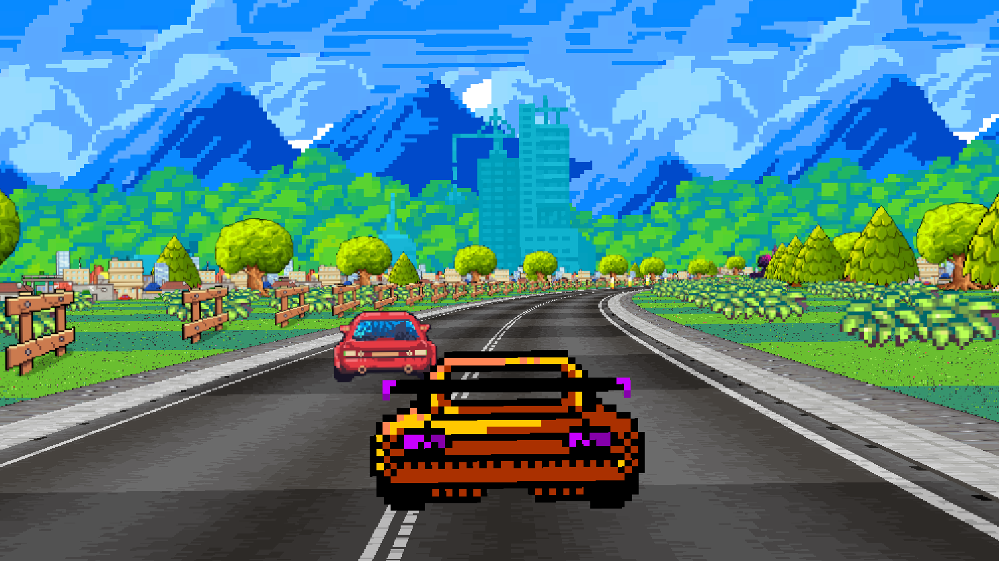
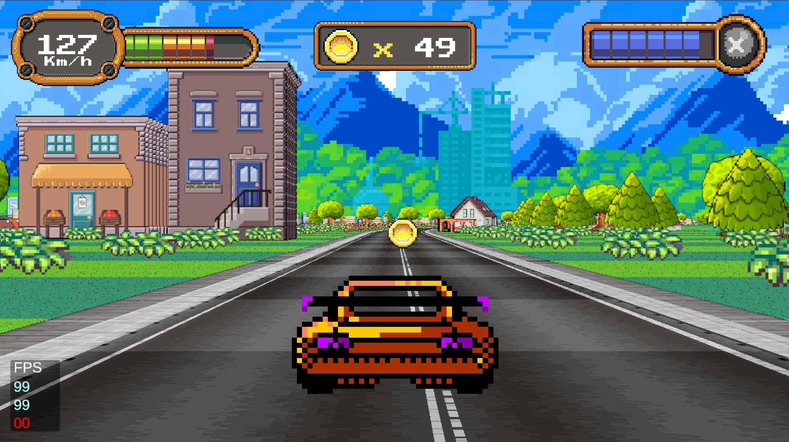
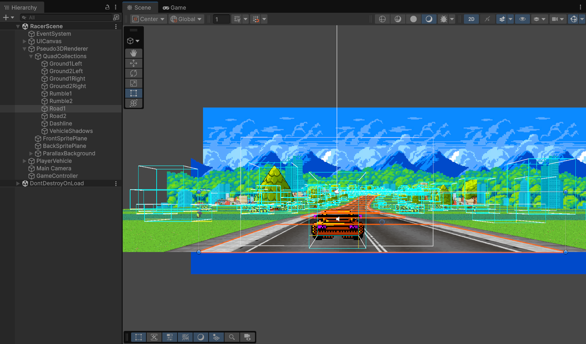

## TurboTrack2D++

Fork of [TurboTrack2D](https://github.com/h8man/TurboTrack2D) with improved rendering, collision detection, vehicles on the road and more.

Small prototype of arcade style racing game with polygon projection technique

## How to play
Play it here: https://carlosmanuelrodr.itch.io/turbotrack2dplus

Builds for Windows, Linux and Android are also available.

## Features
- Pseudo 3D renderering with texture projection
- Collision detection
- Vehicles on the road
- Parallax background
- Gamepad support

Inspired by:

https://www.youtube.com/watch?v=N60lBZDEwJ8

Technical Details:

1. https://codeincomplete.com/articles/javascript-racer/
2. http://www.extentofthejam.com/pseudo/

Thread to disscuss:

https://forum.unity.com/threads/using-unity-to-create-pseudo-3d-graphics.378826/

## Screenshots

## Assets used

Urban Landscape by ansimuz:
https://opengameart.org/content/urban-landscape

Coupe' Car by Chasersgaming:
https://opengameart.org/content/coupe-car

Racing Asset 'Touring Car' SMS by Chasersgaming:
https://opengameart.org/content/racing-asset-touring-car-sms

Spinning Coin 8-Bit Sprite by madcowj:
https://opengameart.org/content/spinning-coin-8-bit-sprite

2.5D Racing Resources by drummyfish:
https://opengameart.org/content/25d-racing-resources

Golden UI - Bigger Than Ever edition by Buch:
https://opengameart.org/content/golden-ui-bigger-than-ever-edition

Car Engine Loop 96kHz, 4s by qubodup:
https://opengameart.org/content/car-engine-loop-96khz-4s

Racing Speed Boost Sound by qubodup:
https://opengameart.org/content/racing-speed-boost-sound